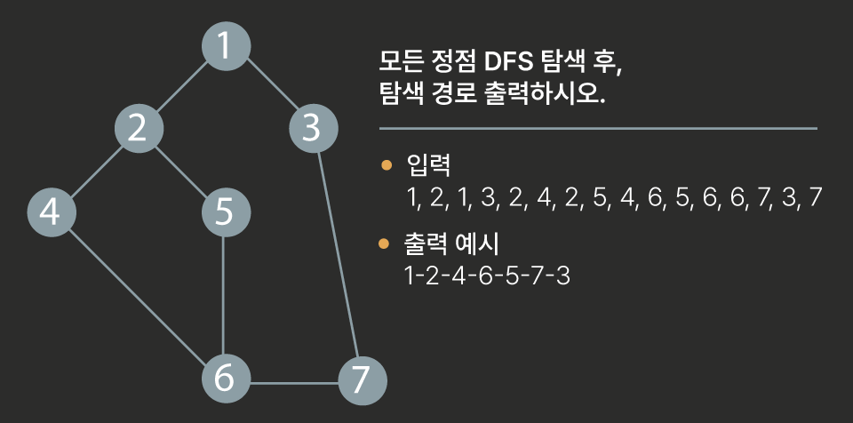

# Stack

- 자료 구조.
- 배열을 사용할 수 있다.
- 마지막 삽입된 원소의 위치 **top** 또는 **stack pointer**.
- LIFO : _Last-In-First-Out_

## 스택의 구현

### 연산

> 1. **push** : 삽입.
> 2. **pop** : 삭제.
> 3. isEmpty : 스택이 공백인지 아닌지 확인.
> 4. peek : 스택의 top 원소(item)을 반환하는 연산.

- `push`
  
  ```python
  def push(item):
      s.append(item)
      # append 단점 : 다소 느림.
  ```
  
  ```python
  # ref.
  # append 보다 속도가 더 빠르다!
  # 팁. overflow 시 size 를 백만개 정도로 미리 생성하고 사용.
  def push(item, size):
      global top
      top += 1
      if top == size:
          print('overflow!')    # debug overflow
      else:
          stack[top] = item
  
  size = 10
  stack = [0] *   size
  top = -1
  
  push(10, size)
  top += 1 # push (20)
  stack[top] = 20 
  ```

- `pop`
  
  ```python
  def pop():
      if len(s)==0:
          # underflow
          return
      else:
          return s.pop(-1)
  ```
  
  ```python
  # ref.
  def pop():
      global top
      if top == -1:
          print('underflow')    # debug underflow
          return 0
      else:
          top -= 1
          return stack [top +1]
  
  print(pop())
  
  if top > -1: # pop()
      top -= 1
      print(stack[top +1])
  ```

- `isEmpty`

- `peek`

### 스택의 응용

#### function call (재귀)

- 함수 호출과 복귀에 따른 전체 프로그램의 수행순서
  

- 재귀를 만들어 쓰는 이유
  
  > 탐색을 위해서!
  > 
  > - 백트래킹, 트리 구조 탐색

- 팩토리얼
  
  
  ```python
  def f(n):           # 팩토리얼 n!
      if n <= 1:
          return 1    # 팩토리얼 1! = 1
      else:
          return n*f(n-1)
  
  for i in range(21):
      print(i, f(i))
  ```

- 피보나치 수열
  
  ```python
  def fibo(n):
      if n<2:
          return n
      else:
          return fibo(n-1)+fibo(n-2)
  ```

- 예제 1.
  
  ```python
  def f(i, N):
      if i == N:
          print(i) # 목표치에서 할 일.
          return
      else:
          print(i) # 단계에서 할 일.
          f(i+1, N)
  
  f(0, 3)
  ```

- 예제 2. 크기가 N인 배열의 모든 원소에 접근하는 재귀 함수.
  
  ```python
  def f(i, N):
      if i == N:      # 배열을 벗어남.
          return
      else:           # 남은 원소가 있는 경우.
          print(A[i])
          f(i+1, N)   # 다음 원소로 이동.
  
  N = 3
  A = [1,2,3]
  f(0, N)             # 0번 원소부터 N개의 원소에 접근.
  ```
  
  #### Memoization

- 중복 호출이 발생하는 경우
  
  - 피보나치 수열의 call tree
  
  

- Memoization 적용 알고리즘 예시 (피보나치 Memoization)
  
  ```python
  # memo를 위한 배열 할당하고, 0으로 초기화.
  # memo[0]을 0, memo[1]을 1로 초기화.
  
  def fibo1(n):
  if n>=2 and len(memo)<=n:
      memo.append(fibo1(n-1) + fibo1(n-2))
      return memo[n]
  
  memo = [0,1]
  ```

## DP (Dynamic Programming)

- 동적 계획 알고리즘

- **최적화 문제**를 해결하는 알고리즘

- 작은 부분 문제를을 해결 후, 그 해를 이용해서 큰 크기의 문제를 해결.

- 피보나치 수 DP 적용 알고리즘
  
  1. 부분 문제로 나누고 **_가장 작은 부분부터_** 해를 구한다.
  
  2. 결과를 테이블에 저장, 저장된 해를 이용해서 상위 문제 해결.
     
     ```python
     def fibo2(n):
       f = [0, 1]
     
       for i in range(2, n+1):
           f.append(f[i-1]+f[i-2])
     
     return f[n]
     ```
     
     ref.
     
     > memoization을 재귀적 구조로 쓰는 것보다 반복적 구조로 DP를 구현한 것이 성능면에서 효율적.
     > 
     > - 재귀함수 호출-복귀 시간이 많이 소요되기 때문에.

## DFS

- 경로로 가다가 더이상 탐색 할 수 없으면 지나온 가장 가까운 갈림길에서 다시 탐색을 시작하는 방법.
  
  - 정점: 탐색할 대상
  - 마지막 갈림길을 저장하는 수단 : 대표적으로 _stack_

- DFS 알고리즘
  
  1. 시작 정점 v 방문
  
  2. v와 인접한 정점 중,
     
     1. _방문하지 않은 정점 w가 있으면_, 정점 v를 stack에 push(기록) 후
     2. w를 v로 하여 다시 반복.
     3. _방문하지 않은 정점이 없으면_, stack를 pop하여 마지막 정점을 v로 하여 다시 반복.
  
  3. stack이 공백이 될 때 까지 위를 반복.
     
     ```
     # DFS pseudo code
     visited[], stack[] 초기화
     DFS(v)
     시작점 v 방문;
     visited[v] = true;      # 정점 방문 처리.
     while {
     if (v의 인접 정점 중 방문 안 한 정점 w가 있으면)
      push(v);
      v = w;              # w에 방문.
      visited[w] = true;  # 정점 방문 처리.
     else
      if (스택이 비어있지 않으면)
        v = pop(stack);
      else
        break
     }
     ```

- DFS 예제
  
  > A 에서 시작해서 DFS 탐색
  
  
  
  ```python
  # 정점의 개수 7개
  # A~G (0~6)
  # adjList 인접한 정점 리스트
  adjList = [[1,2],   #0
             [0,3,4], #1
             [0,4],   #2
             [1,5],   #3
             [1,2,5], #4
             [3,4,6], #5
             [5]]     #6
  
  def dfs(v, N):
      visited = [0]*N             # visited 생성
      stack = [0]*N               # stack 생성
      top = -1
  
      visited[v] = 1              # 시작점 방문 표시
      while True:
          for w in adjList[v]:    # ajdList 순회
              if visited[w] == 0:
                  top += 1        # push(v)
                  stack[top] = v
                  v = w
                  print(v)        # 방문동작
                  visited[w] = 1  # visited 처리
                  break
          else:
              if top != 1:        # stack이 비어있지 않으면,
                  v = stack[top]  # pop
                  top -= 1
              else:               # stack이 비어있으면,
                  break
  
  dfs(0, 7)
  ```

- 추가. 간선 입력
  
  ```python
  # 0번부터 v번까지, E개의 간선
  # 6 8
  # 0 1
  # 0 2
  # 1 3
  # 1 4
  # 2 4
  # 3 5
  # 4 5
  # 5 6
  
  V, E = map(int, input().split())
  N = V + 1
  adjList = [[] for _ in range(N)]
  for _ in range(E):
      a, b = map(int, input().split())
          adjList[a].append[b]
          adjList[b].append[a]
  ```

- 추가. 재귀 DFS
  
  ```python
  def dfs(v):
      print(v)                # v 방문
      visited[v] = 1
      for w in adjList[v]:
          if visited[w] == 0: # 방문하지 않은 w
              dfs(w)
  ```

- 교수님 코드 - append 사용
  
  ```python
  # 1
  G = {'A': ['B', 'C'], 'B':['A', 'D', 'E'], 'C':['A', 'E'],
      'D':['B', 'F'], 'E':['B', 'C', 'F'], 'F':['D', 'E', 'G'], 'G':['F']}
  
  # 'A' : 0
  # 'B' : 1
  # ord(w) - ord('A')
  
  def dfs(v):
      visited = [False]*7
      ST = []
  
      print(v)                            # 방문처리
      visited[ord(v)-ord('A')] = True
  
      while True:
          v = ST.pop()
          for w in G[v]:
              if visited[ord(w) - ord('A')] == False:
                ST.append(v)
                print(w)
                visited[ord(w)-ord('A')] = True
                v = w
                break
              else:
                  if len(ST):
                      v = ST.pop()
                  else:
                      break
  
  dfs('A')
  ```
  
  ```python
  # 2
  def dfs(v):
      visited = [False]*7
      ST = []
  
      print(v)
      visited[ord(v)-ord('A')] = True
      ST.append(v)
      while len(ST):
          v = ST.pop()
          for w in G[v]:
              if visited[ord(w)-ord('A')] == False:
                  ST.append(w)
                  print(w)
                  visited[ord(w)-ord('A')] = True
  dfs('A')
  ```

- 연습문제 3
  
  
  ```python
  # input = '1, 2, 1, 3, 2, 4, 2, 5, 4, 6, 5, 6, 6, 7, 3, 7'
  numV = 7
  G = [[] for _ in range(numV+1)]
  lst = list(map(int, inputV.split()))
  for i in range(0, len(lst), 2):     # 그래프 만들기
    p1 = lst[i]
    p2 = lst[i+1]
    G[p1].append(p2)
    G[p2].append(p1)
  
  def dfs(v):
      visited = [False] * (numV+1)
      ST = []
      ST.append(v)
      # 방문처리
      print(v)
      visited[v] = True
  
      while ST:
          v = ST.pop()
              if not visited[w]:
                  ST.append(w)
                  print(w)
                  visited[w] = True
  ```